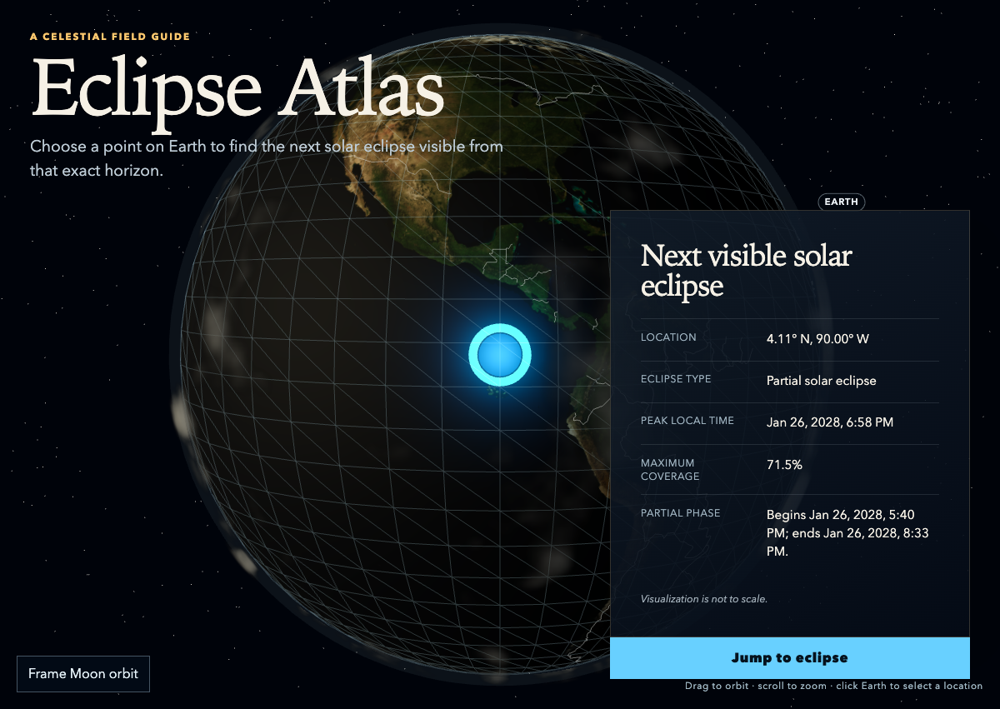
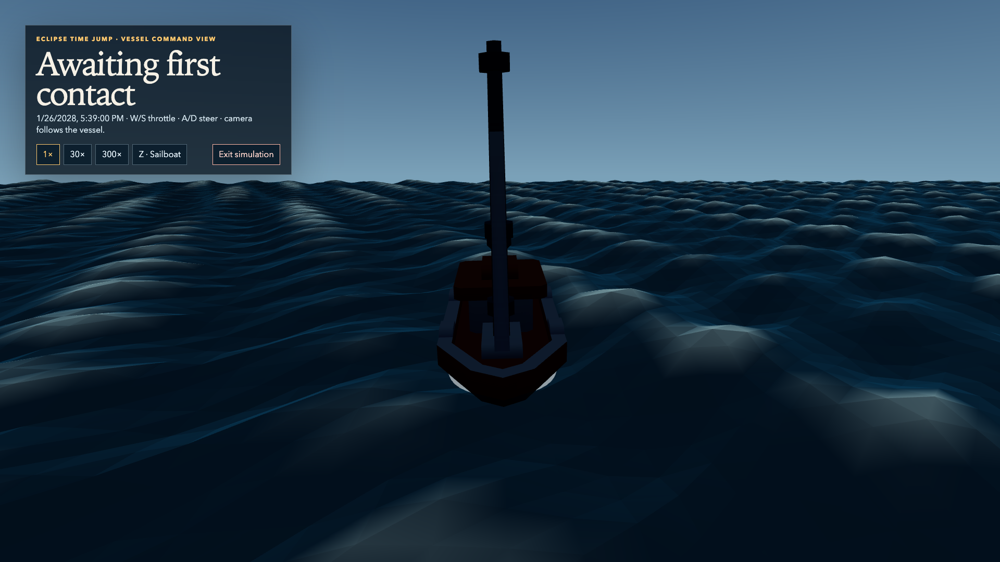

# Eclipse Atlas

**Find the next solar eclipse visible from any point on Earth, then step into a cinematic local simulation of its approach.**

Eclipse Atlas is a browser-based astronomy experience built around an interactive 3D globe. Select a point on the real Earth map, receive local eclipse circumstances calculated in-browser, and optionally enter a real-time observer view beginning two minutes before first contact.



## What it does

- **Select an observing point** directly on a textured, geographically referenced 3D Earth.
- **Calculate the next locally visible solar eclipse** for that exact latitude and longitude, including eclipse type, peak local time, coverage, and phase timings.
- **Keep the result local:** an eclipse whose partial phase remains below the local horizon is skipped.
- **Jump to the event** from a stylized land or ocean observer scene, beginning at real-time speed two minutes before first contact.
- **Explore the scene:** land mode supports mouse-look and movement; ocean mode provides a third-person vessel command view with multiple craft.

## Experience

1. Orbit, zoom, and click the visible surface of Earth.
2. Review the next eclipse visible from that horizon.
3. Select **Jump to eclipse** to enter the observer scene.
4. Follow the event in real time, or opt into 30× or 300× playback.



## Controls

| Context | Controls |
| --- | --- |
| Globe | Drag to orbit · scroll to zoom · click Earth to select a location |
| Land Time Jump | Click the scene for mouse-look · **W/A/S/D** to move |
| Ocean Time Jump | **W/S** or ↑/↓ for throttle · **A/D** or ←/→ to steer |
| Ocean vessel | **Z** cycles sailboat, fishing trawler, cargo ship, and cruise ship |
| Simulation | Use the HUD for 1×, 30×, or 300× time and to exit |

## Core components

| Area | Responsibility |
| --- | --- |
| `GlobeScene` | React Three Fiber globe, map interaction, selection marker, borders, and major-city data. |
| `eclipse-service` | Astronomy Engine boundary that finds the next eclipse with an above-horizon local phase. |
| `EclipseResultCard` | Accessible presentation of location, type, peak time, coverage, and phase circumstances. |
| `EclipseTimeJump` | Observer-mode timeline, local scene selection, celestial display, and simulation controls. |
| `OceanVessel` | Third-person craft, buoyancy samples, steering, chase camera, and model switching. |
| Atmosphere modules | Deterministic cloud field, GPU cloud shader, star projection, and atmospheric sky treatment. |

## Scientific model and visual model

Eclipse calculations use [Astronomy Engine](https://github.com/cosinekitty/astronomy) in the browser. The service validates coordinates and searches forward until a partial, peak, or end phase is above the observer’s horizon. Results are formatted in the browser’s local time zone.

The Time Jump is intentionally a **visual interpretation**, not a survey-grade reconstruction of an observing site. The displayed Sun and Moon use topocentric directions for the simulated observer time; their screen-friendly discs, perceptual horizon cue, terrain, ocean, clouds, vessel behavior, and sky are real-time render approximations. They do not alter the eclipse calculation or its contact times.

## Run locally

**Prerequisite:** Node.js 20 or newer.

```bash
git clone https://github.com/IotA-asce/eclipse-atlas.git
cd eclipse-atlas
npm install
npm run dev
```

Open the URL printed by Vite, usually `http://localhost:5173`.

### Verify

```bash
npm run lint
npm run test
npm run build
npm run test:e2e
```

## Project structure

```text
src/
├── app/                 # Application state and primary flow
├── components/          # Globe, result card, observer scene, vessel
├── features/
│   ├── eclipse/         # Local eclipse search and presentation mapping
│   ├── time-jump/       # Timeline, terrain, ocean, buoyancy, navigation
│   └── atmosphere/      # Cloud evolution and rendering
└── styles/              # Global visual system
public/
├── models/              # Local CC0 watercraft assets
└── textures/            # Bundled Earth and Moon imagery
```

## Data and attribution

- Earth surface: [NASA Blue Marble Next Generation](https://svs.gsfc.nasa.gov/12564/) (2004 topography, 5400 × 2700), rendered locally as an sRGB equirectangular texture.
- Country boundaries: [Natural Earth](https://www.naturalearthdata.com/) Admin 0 boundary lines, public domain.
- Land relief: [NASA/ASTER Global Digital Elevation Map](https://commons.wikimedia.org/wiki/File:GDEM_elevation_map_3600x1800.png), public domain.
- Moon texture: [NASA SVS CGI Moon Kit](https://svs.gsfc.nasa.gov/4720/), based on Lunar Reconnaissance Orbiter imagery.
- Stars: [HYG Database](https://github.com/astronexus/hyg-database), locally bundled to apparent magnitude 6.5.
- Watercraft: [Kenney Watercraft Kit](https://kenney.nl/assets/watercraft-kit), CC0; the license is retained with the bundled files.

The cloud field is deterministic and locally simulated. It is neither a forecast nor observed weather. Its rendering approach takes inspiration from [Sebastian Lague’s cloud experiment](https://github.com/SebLague/Clouds); the ocean uses a shared Gerstner-style wave field and is a visual sea-state model, not CFD or a naval-stability solver.

## Screenshots

The images above are captured from the local development build and are maintained with the repository in [`docs/screenshots`](docs/screenshots/).

## License

Project source licensing has not yet been specified. Third-party data and assets retain the attribution and terms noted above.
